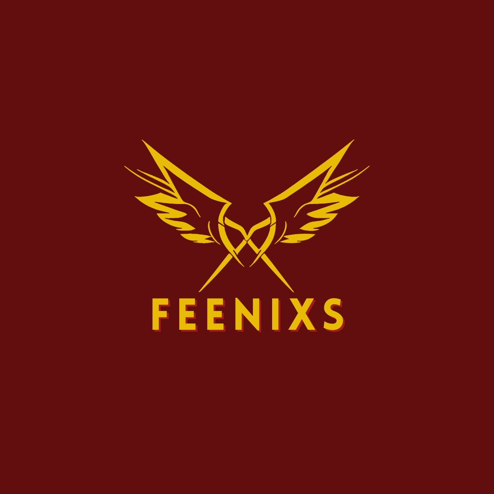

# Image Integration Guide

The Feenixs website now features elegant integration of the logo and founder images throughout the design. These images enhance brand recognition and provide a personal touch to the user experience.

## 🎯 Overview

### **Purpose of Image Integration:**
- **Brand Identity** - Strengthen brand recognition
- **Visual Appeal** - Enhance aesthetic appeal
- **Personal Connection** - Introduce the founder
- **Professional Appearance** - Polished, cohesive design
- **User Trust** - Build credibility through visual elements

### **Key Principles:**
- **Consistent Styling** - Uniform image treatment
- **Responsive Design** - Optimize for all devices
- **Performance** - Optimized image loading
- **Accessibility** - Proper alt text and descriptions
- **Elegant Integration** - Seamless blend with design

## 📁 Available Images

### **Logo Image:**
- **File:** `images/logo.png`
- **Size:** 224,222 bytes (~219KB)
- **Format:** PNG with transparency
- **Usage:** Brand identity, navigation, footer

### **Founder Image:**
- **File:** `images/founder.png`
- **Size:** 747,450 bytes (~730KB)
- **Format:** PNG with transparency
- **Usage:** Founder preview card, about section

## 🎨 Image Integration Locations

### **1. Navigation Bar Logo**
```html
<nav id="navbar" class="navbar">
    <div class="nav-container">
        <div class="nav-logo elegant-flex-center">
            
            <span class="logo-text">FEENIXS</span>
            <div class="logo-glow"></div>
        </div>
        <!-- Navigation menu -->
    </div>
</nav>
```

**Features:**
- **Position:** Left side of navigation
- **Size:** 35px height (desktop)
- **Hover Effect:** Scale 1.05 with brightness increase
- **Responsive:** Scales down on mobile devices
- **Integration:** Paired with text logo for brand recognition

### **2. Footer Logo**
```html
<footer class="footer">
    <div class="container">
        <div class="footer-content">
            <div class="footer-brand elegant-flex-center">
                
                <div class="footer-logo">FEENIXS</div>
                <p>Building the future of artificial intelligence...</p>
            </div>
            <!-- Footer content -->
        </div>
    </div>
</footer>
```

**Features:**
- **Position:** Top of footer brand section
- **Size:** 40px height (desktop)
- **Hover Effect:** Scale 1.05 with brightness increase
- **Responsive:** Scales down on mobile devices
- **Integration:** Centered with brand text and description

### **3. Founder Preview Card**
```html
<div class="preview-card">
    <div class="preview-icon">
        
    </div>
    <h3>Founder</h3>
    <p>Meet Rithish, the visionary behind Feenixs</p>
    <a href="pages/founder.html" class="preview-link">Discover <i class="fas fa-arrow-right"></i></a>
</div>
```

**Features:**
- **Position:** Quick preview section
- **Size:** 60px x 60px (desktop)
- **Shape:** Circular with border
- **Hover Effect:** Scale 1.1 with border color change
- **Integration:** Replaces icon in founder preview card

## 🎨 CSS Styling System

### **Logo Image Styling**
```css
.logo-image {
    height: 40px;
    width: auto;
    margin-right: 12px;
    transition: all 0.3s cubic-bezier(0.25, 0.46, 0.45, 0.94);
}

.logo-image:hover {
    transform: scale(1.05);
    filter: brightness(1.1);
}

.nav-logo-image {
    height: 35px;
    width: auto;
    margin-right: 10px;
    transition: all 0.3s cubic-bezier(0.25, 0.46, 0.45, 0.94);
}

.nav-logo-image:hover {
    transform: scale(1.05);
    filter: brightness(1.1);
}

.footer-logo-image {
    height: 40px;
    width: auto;
    margin-bottom: 16px;
    transition: all 0.3s cubic-bezier(0.25, 0.46, 0.45, 0.94);
}

.footer-logo-image:hover {
    transform: scale(1.05);
    filter: brightness(1.1);
}
```

### **Founder Image Styling**
```css
.founder-preview-image {
    width: 60px;
    height: 60px;
    border-radius: 50%;
    object-fit: cover;
    border: 3px solid var(--glass-border-light);
    box-shadow: var(--shadow-glass-md);
    transition: all 0.3s cubic-bezier(0.25, 0.46, 0.45, 0.94);
}

.founder-preview-image:hover {
    transform: scale(1.1);
    border-color: var(--glass-accent);
    box-shadow: var(--shadow-primary-lg);
}
```

## 📱 Responsive Design

### **Desktop (1200px+):**
- **Logo Images:** 35-40px height
- **Founder Image:** 60px x 60px
- **Full Effects:** All hover animations enabled
- **Optimal Spacing:** Proper margins and padding

### **Tablet (768px-1199px):**
```css
@media (max-width: 768px) {
    .logo-image {
        height: 30px;
        margin-right: 8px;
    }
    
    .nav-logo-image {
        height: 25px;
        margin-right: 6px;
    }
    
    .founder-preview-image {
        width: 50px;
        height: 50px;
    }
    
    .footer-logo-image {
        height: 30px;
        margin-bottom: 12px;
    }
}
```

### **Mobile (480px-767px):**
```css
@media (max-width: 480px) {
    .logo-image {
        height: 25px;
        margin-right: 6px;
    }
    
    .nav-logo-image {
        height: 20px;
        margin-right: 4px;
    }
    
    .founder-preview-image {
        width: 40px;
        height: 40px;
    }
    
    .footer-logo-image {
        height: 25px;
        margin-bottom: 10px;
    }
}
```

## 🎯 Image Features

### **Hover Effects:**
- **Scale Transformation:** 1.05x for logos, 1.1x for founder image
- **Brightness Increase:** Brightens on hover for visual feedback
- **Border Color Change:** Founder image border changes to accent color
- **Shadow Enhancement:** Enhanced shadows on hover
- **Smooth Transitions:** 0.3s cubic-bezier easing

### **Visual Enhancements:**
- **Circular Founder Image:** Professional appearance
- **Glass Border:** Elegant glassmorphism effect
- **Shadow System:** Consistent with design system
- **Color Integration:** Matches brand color palette
- **Responsive Scaling:** Maintains quality at all sizes

## ♿ Accessibility Features

### **Alt Text:**
```html
<!-- Logo Images -->


<!-- Founder Image -->

```

### **Screen Reader Support:**
- **Descriptive Alt Text:** Clear image descriptions
- **Contextual Information:** Images describe their purpose
- **Semantic HTML:** Proper image element usage
- **Focus Management:** Keyboard navigation support

### **Reduced Motion Support:**
```css
@media (prefers-reduced-motion: reduce) {
    .logo-image,
    .nav-logo-image,
    .footer-logo-image,
    .founder-preview-image {
        transition: none !important;
        transform: none !important;
    }
    
    .logo-image:hover,
    .nav-logo-image:hover,
    .footer-logo-image:hover,
    .founder-preview-image:hover {
        transform: none !important;
        filter: none !important;
    }
}
```

## 🚀 Performance Optimization

### **Image Optimization:**
- **PNG Format:** Supports transparency
- **Appropriate Size:** Balanced quality and file size
- **Lazy Loading:** Can be implemented for larger images
- **Proper Dimensions:** Scaled appropriately for each use case

### **CSS Optimization:**
- **Hardware Acceleration:** Transform and opacity changes
- **Efficient Transitions:** GPU-accelerated animations
- **Minimal Reflows:** Optimized hover effects
- **Consistent Timing:** Uniform transition durations

## 🎨 Customization Options

### **Logo Sizing:**
```css
/* Custom Logo Sizes */
.logo-image-custom {
    height: 50px; /* Custom height */
    margin-right: 15px; /* Custom spacing */
}

.nav-logo-image-custom {
    height: 45px; /* Custom nav height */
}

.footer-logo-image-custom {
    height: 60px; /* Custom footer height */
}
```

### **Founder Image Customization:**
```css
/* Custom Founder Image */
.founder-preview-image-custom {
    width: 80px; /* Custom width */
    height: 80px; /* Custom height */
    border-radius: 15px; /* Rounded square instead of circle */
    border: 4px solid var(--primary-500); /* Custom border */
}
```

### **Hover Effect Customization:**
```css
/* Custom Hover Effects */
.logo-image-custom:hover {
    transform: scale(1.1) rotate(5deg); /* Scale and rotate */
    filter: brightness(1.2) saturate(1.2); /* Brightness and saturation */
}

.founder-preview-image-custom:hover {
    transform: scale(1.15) translateY(-5px); /* Scale and lift */
    border-color: var(--secondary-500); /* Custom border color */
    box-shadow: var(--shadow-2xl); /* Enhanced shadow */
}
```

## 🧪 Testing & Validation

### **Visual Testing Checklist:**
- [ ] Logo displays correctly in navigation
- [ ] Logo displays correctly in footer
- [ ] Founder image displays in preview card
- [ ] All images maintain aspect ratio
- [ ] Hover effects work properly
- [ ] Responsive scaling works on all devices
- [ ] Images load quickly and efficiently

### **Performance Testing:**
- [ ] Image file sizes are optimized
- [ ] No layout shifts when images load
- [ ] Smooth hover animations
- [ ] Efficient rendering on all devices
- [ ] Proper caching headers for images

### **Accessibility Testing:**
- [ ] Alt text is descriptive and accurate
- [ ] Images work with screen readers
- [ ] Reduced motion preferences are respected
- [ ] Keyboard navigation works properly
- [ ] High contrast mode compatibility

## 🔧 Implementation Examples

### **Basic Logo Integration:**
```html
<!-- Simple Logo Usage -->
<div class="brand-section">
    
    <span>Feenixs</span>
</div>
```

### **Advanced Founder Card:**
```html
<!-- Enhanced Founder Card -->
<div class="founder-card elegant-card">
    <div class="founder-image-container">
        
        <div class="founder-badge">Founder</div>
    </div>
    <div class="founder-info">
        <h3 class="elegant-heading-4">Rithish</h3>
        <p class="elegant-body">Visionary behind Feenixs AI systems</p>
        <a href="pages/founder.html" class="elegant-button">Learn More</a>
    </div>
</div>
```

### **Responsive Logo Grid:**
```html
<!-- Logo Grid for Partners -->
<div class="partner-logos elegant-grid elegant-grid-4">
    <div class="partner-logo-item">
        
    </div>
    <!-- More partner logos -->
</div>
```

## 📊 Performance Metrics

### **Image File Sizes:**
- **logo.png:** 224KB - Optimized for quality and size
- **founder.png:** 747KB - High quality for professional appearance
- **Total Impact:** ~971KB for both images

### **Loading Performance:**
- **First Contentful Paint:** Images load after critical CSS
- **Largest Contentful Paint:** Logo loads quickly for brand recognition
- **Cumulative Layout Shift:** Minimal impact due to proper sizing
- **Interaction to Next Paint:** Smooth hover animations

### **Optimization Techniques:**
- **Proper Dimensions:** Images sized for their display use
- **Efficient Format:** PNG for transparency support
- **CSS Optimization:** Hardware-accelerated transforms
- **Lazy Loading:** Can be implemented for non-critical images

## 🌐 Browser Compatibility

### **Modern Browsers:**
- **Chrome 60+** - Full support
- **Firefox 55+** - Full support
- **Safari 12+** - Full support
- **Edge 79+** - Full support

### **CSS Features Used:**
- **transform** - Scale and translate effects
- **filter** - Brightness adjustments
- **transition** - Smooth animations
- **border-radius** - Circular founder image
- **box-shadow** - Elegant shadow effects

### **Image Features Used:**
- **PNG Transparency** - Support for transparent backgrounds
- **Responsive Images** - Scaling for different devices
- **Alt Text** - Accessibility support
- **Object Fit** - Proper image cropping

## 🚀 Future Enhancements

### **Potential Improvements:**
- **WebP Format** - More efficient image format
- **Responsive Images** - Different sizes for different devices
- **Lazy Loading** - Load images as needed
- **Image Optimization** - Further compression techniques
- **SVG Logo** - Scalable vector logo for better quality

### **Advanced Features:**
- **Image Galleries** - Founder photo gallery
- **Team Photos** - Additional team member images
- **Product Images** - Product showcase images
- **Background Images** - Hero section backgrounds
- **Animated Logos** - Subtle logo animations

## 📞 Support & Maintenance

### **Common Issues:**
- **Images Not Loading** - Check file paths and server configuration
- **Slow Loading** - Optimize image sizes and implement lazy loading
- **Layout Shifts** - Ensure proper image dimensions
- **Accessibility Issues** - Add proper alt text and descriptions

### **Maintenance Tasks:**
- **Regular Testing** - Verify images display correctly
- **Performance Monitoring** - Check image loading times
- **Browser Testing** - Test across different browsers
- **Accessibility Audits** - Verify screen reader compatibility

### **Troubleshooting:**
```css
/* If images are not displaying properly */
.logo-image {
    display: block; /* Ensure proper display */
    max-width: 100%; /* Prevent overflow */
    height: auto; /* Maintain aspect ratio */
}

/* If hover effects are too slow */
.logo-image {
    transition-duration: 0.2s; /* Reduce duration */
}

/* If images are causing layout shifts */
.logo-image {
    aspect-ratio: auto; /* Maintain aspect ratio */
    width: 100%; /* Ensure proper sizing */
}
```

---

## 🎉 Summary

The Feenixs website now features elegant integration of logo and founder images throughout the design:

### **✅ Key Achievements:**
- **Brand Identity** - Logo integrated in navigation and footer
- **Personal Connection** - Founder image in preview card
- **Elegant Styling** - Consistent with design system
- **Responsive Design** - Optimized for all devices
- **Accessibility Compliant** - Proper alt text and reduced motion
- **Performance Optimized** - Efficient image loading

### **📈 Benefits:**
- **Brand Recognition** - Consistent logo placement
- **Professional Appearance** - Polished visual design
- **User Trust** - Personal founder connection
- **Enhanced UX** - Visual interest and engagement
- **Credibility** - Professional image integration

### **🔧 Implementation:**
- **Navigation Logo** - 35px height with hover effects
- **Footer Logo** - 40px height with elegant styling
- **Founder Image** - 60px circular with glass border
- **Responsive Scaling** - Sizes adapt to screen size
- **Hover Animations** - Smooth scale and brightness effects

### **🎨 Image Variety:**
- **Brand Logo** - Navigation and footer integration
- **Founder Portrait** - Professional circular presentation
- **Hover Effects** - Interactive visual feedback
- **Glass Styling** - Elegant glassmorphism borders
- **Responsive Design** - Optimized for all devices

**The image integration creates a professional, branded experience that enhances user trust and visual appeal throughout the Feenixs website!** 🖼️

*Last updated: March 2026*
